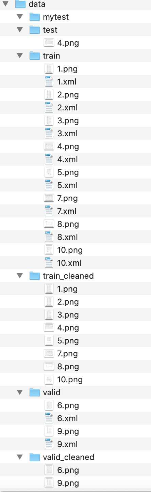

# UNet Seal Elimination
UNet 实现文档印章消除

# Requirement
pytorch==1.5
opencv-python 4.2
numpy

# Use
1. data 的目录结构如下图：

- test：测试集图片的路径
- mytest：测试结果的输出路径
- train：训练集图片的路径，包含含印章的图片以及标注印章位置的xml文件
- train_cleaned：训练集图片人工去除印章后的标签
- valid：验证集图片的路径，包含含印章的图片以及标注印章位置的xml文件
- valid_cleaned：验证集图片人工去除印章后的标签
2. config.py 
    设置参数，包括文件路径、模型结构参数和训练的参数等。
3. train.py
    运行 python train.py 训练模型。
4. predict.py
    运行 python predict.py 测试。

# Note:
1. 由于作者所使用的图像分辨率极高，在训练和测试时从完整图像中扣出包含印章的区域(ImageSize=512*512)，然后进行训练。如果图片的分辨率适中或者显存足够大，可以跳过此步骤，无需进行印章标注，直接使用原图进行UNet训练。
2. 从原图中扣出印章区域也可以使用yolo代替。

# Reference
[unet-denoising-dirty-documents](https://github.com/1024210879/unet-denoising-dirty-documents). 

[Pytorch-Unet](https://github.com/milesial/Pytorch-UNet)
